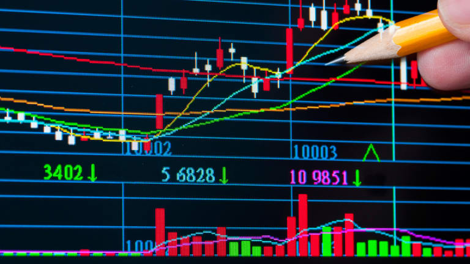
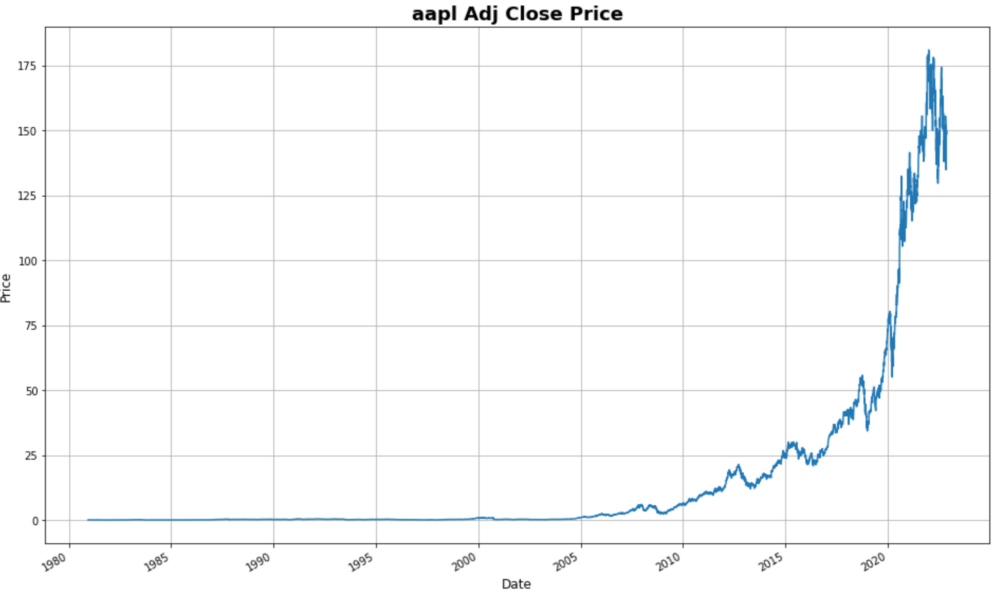
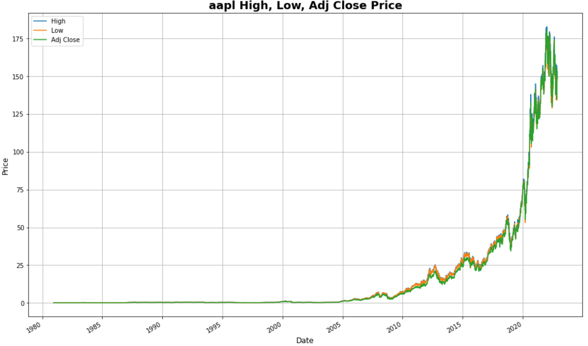
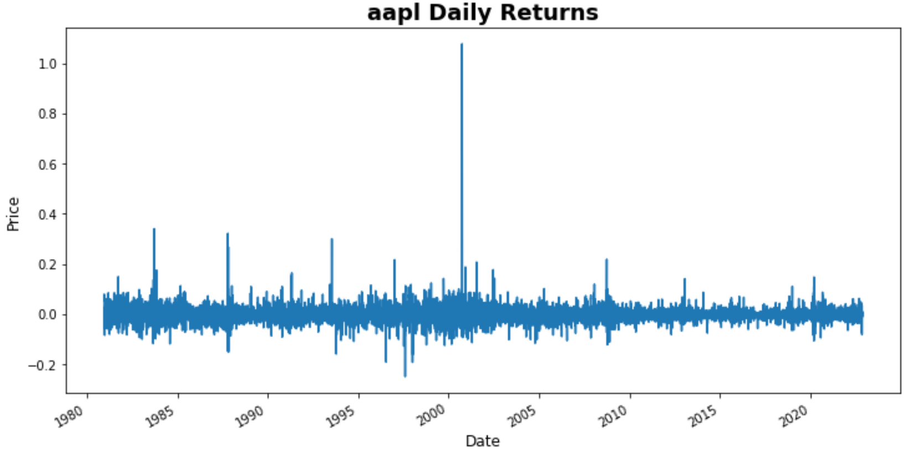
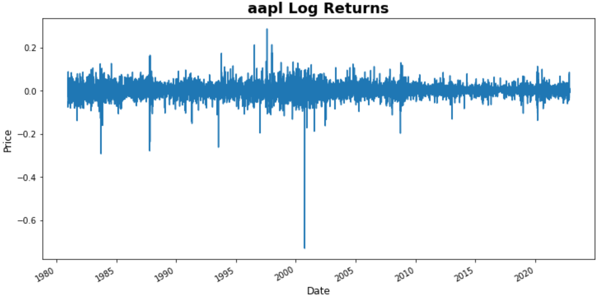
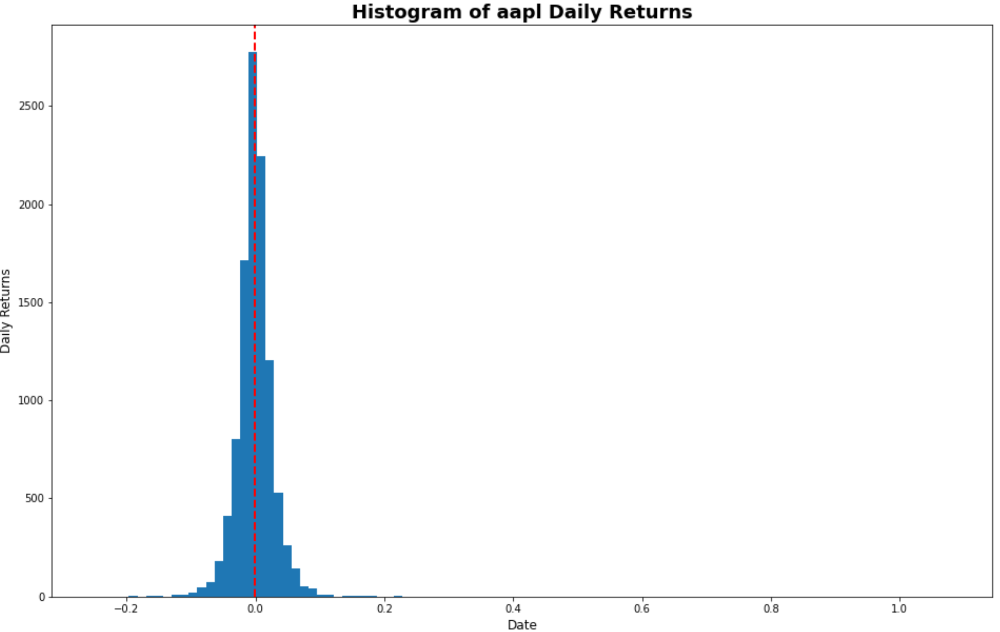
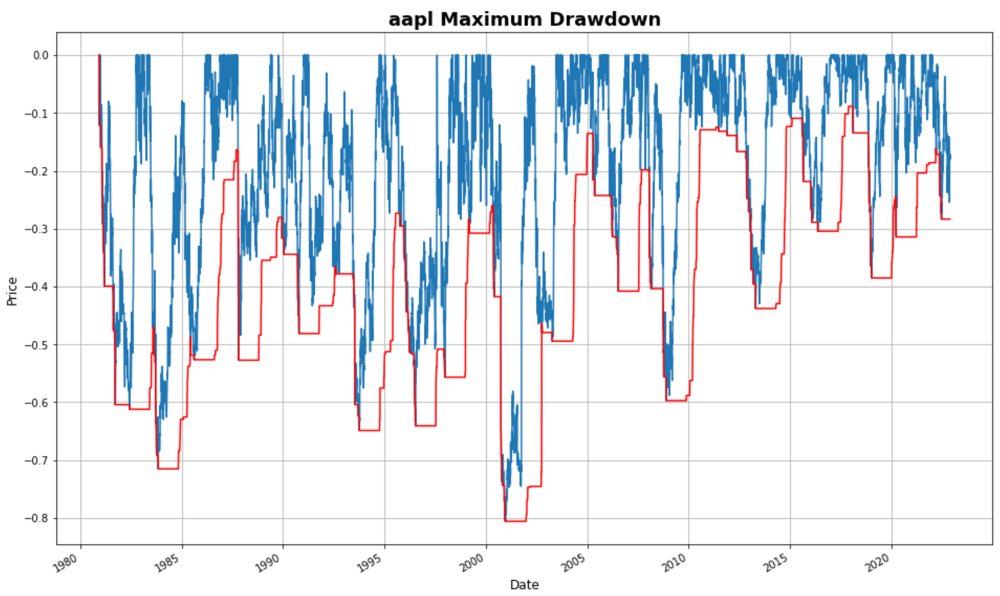

# Basic Stock Analysis

Stock analysis is the evaluation or examination of the stock market. There are many trading tools to use to analyze stocks; such as fundamental and technical analysis. Fundamental analysis is more focused on data from the financial statements, economic reports, and company assets. Technical analysis is based on the study of the past of historical price to predict the future price movement.

This is an extremely basic stock analysis tutorial. 

There are 7 parts in this tutorial.

### Directory

1. [Libraries Used ](#Libraries-Used)
2. [Get data from Yahoo](#Get-Data)
3. [Analyze Data](#Analyze-Data)    
4. [Understand the Data based on Statistics](#Understand-the-Data) 
5. [Calculate Prices](#Calculate-the-Prices)
6. [Plot Charts](#Plot-Visualization)
7. [Calculate Holding Period Return
](#Calculate-Holding-Period-Return) 

### Libraries Used
[Directory](#Directory)

**Data handling:**
pandas

**Numerical calculations:**
numpy

**Visualization:**
matplotlib

**Ignore Warnings:**
warnings

**Stock price information**
yfinance

**Technical Analysis Indicators**
talib

---

### Get Data
[Directory](#Directory)

**Pull the ticker from the Yahoo Finance API**
yfinance.download()

### Analyze Data
[Directory](#Directory)

- display the first and last 5 rows of the dataset using the built in functions froms pandas
    - df.head()
    -df.tail()
    
- Show the quantity of rows and columns
    - df.shape()
    
- Show the column names
    - df.columns
    
- Show the data types of each column
    - df.dtypes
    
- Show information about DataFrame
    - df.info() 
    
- Show summary statistics based on stock data 
    - df.describe() 

---

### Understand the Data
[Directory](#Directory)

Using "Adj. Close" price to find the minimum, maximum, average and standard deviation prices. The reason we are using "Adj. Close" is to show historical returns. The Adjusted Prices itakes into account the dividend and splits, while the Close price does not include dividend and splits.

**Find the minimum**
df['Adj Close'].min()

**Find the maximum**
df['Adj Close'].max()

**Find the average**
df['Adj Close'].mean()

---

### Calculate the Prices
[Directory](#Directory)

This section, we will be calculating the daily returns, log returns, and other technical indicators such as RSI(Relative Strength Index), MA(Moving Average), SMA(Simple Moving Averga), EMA(Exponential Moving Average), and VWAP(Voume Weighted Average Price). We will also calculate drawdowns.

**Daily Returns**

df['Daily_Returns'] = df['Adj Close'].shift(1) / df['Adj Close']  - 1

**Alternative method to calculate Daily Returns:**

df['Adj Close'].pct_change(1) # 1 is for "One Day" in the past

**Log Returns**

np.log(df['Adj Close']) - np.log(df['Adj Close'].shift(1))

We will now use the talib library to access tools to perform technical analysis. This will precent us from having to do long handed calculatins!

ta.RSI()

ta.MA()

ta.SMA()

ta.EMA()

**Volume Weighted Average Price - VWAP**

round(np.cumsum(df['Volume']*(df['High']+df['Low'])/2) / np.cumsum(df['Volume']), 2)

**Drawdown**

Drawdown shows the decline price since the stock began trading
https://www.investopedia.com/terms/d/drawdown.asp
 - There are 252 trading day in a year

**Calculate the maximum drawdown**

Use the min_period of 1 (1 is the least valid observations) for the first 252 day in the data
Maximum_Drawdown = df['Adj Close'].rolling(window, min_periods=1).max()
Daily_Drawdown = df['Adj Close']/Maximum_Drawdown - 1.0

**Calculate the negative drawdown**

Negative_Drawdown = Daily_Drawdown.rolling(window, min_periods=1).min()

---

### Plot-Visualization
[Directory](#Directory)

Use matplot lib to depict the stocks:
- adjusted closing price

- Adjusted close, high, low

- Daily Returns

- Log Returns

- Histogram Distribution

- Plot Drawdown

### Calculate Holding Period Return
[Directory](#Directory)

Holding period return (HPR) is the rate of return on an individual stocks or portfolio over the whole period during the time it was held. It is a measurement of investment performance.

- Analyze the Dividends
- Calculate the projected investment total after holding from the beginning and selling it at current.

<!-- Created by Richie Garafola 11/16/2022 -->